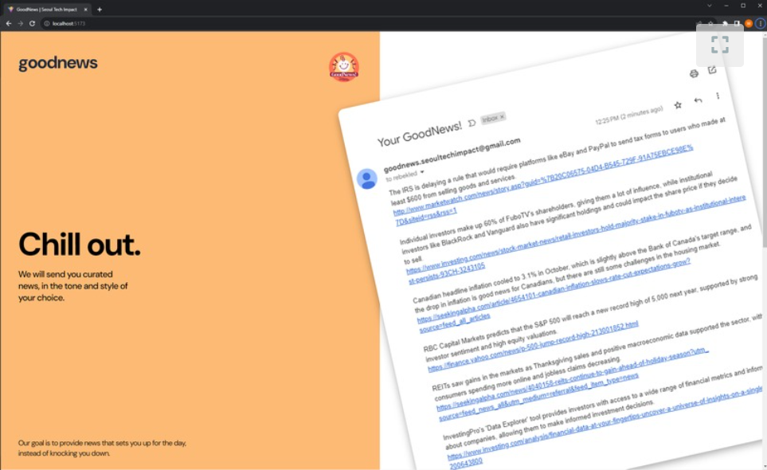

# GAI News Curator



An open-source project helping people curate their news in a healthy, positive way.

## Dev Installation

Create a virtual environment as desired, and then:

```commandline
git clone git@github.com:GAI-News/news-curator.git goodnews && cd goodnews
pip install -r requirements.txt
```

## Set up your config file

To run the backend end-to-end, you need to place the following into your [config.ini](curator/config/config.ini) file:

1. **OpenAI API key**. This is used to connect to GPT.
2. (Optional) **Huggingface API Key**. If you would like to run the local AI components, instead of GPT, you will need 
to add a HF API Key.
3. **User Email**. Output emails can be sent to any user. By default they will be sent to the user email contained in 
your  config.
4. **Email** / **Email Password**. Emails will be sent to users *from* the email address in your config. You will need 
to provide the email and email password.

## Run the Server

First run the backend app, which will start a REST server listening to requests. Refer to the server class for 
documentation on end points.

```commandline
python -m gunicorn -w 1 -b localhost:8080 -k uvicorn.workers.UvicornWorker curator.backend.server:app
```

Once the server is up and running, you can make queries to it, as show in client sample:

```commandline
python curator/samples/client.py --host localhost:8080/
```

## Sample Modules

There are a number of individual samples, which can be used to see how to use individual module components.

### NewsCollector 

```commandline
python curator/samples/newscollector_simple.py
```

### GPT

Running the GPT sample requires you place an OpenAI key in your [config.ini](curator/config/config.ini) file. And then:

```commandline
python curator/samples/gpt_simple.py
```

### Bart

Running the Bart sample requires you place a Huggingface key in you [config.ini](curator/config/config.ini) file, 
as well as install all the local dependencies:

```commandline
pip install -r local_requirements.txt
python curator/samples/bart_simple.py
```


